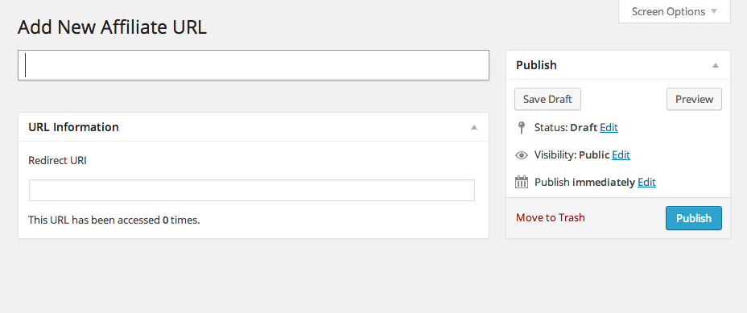
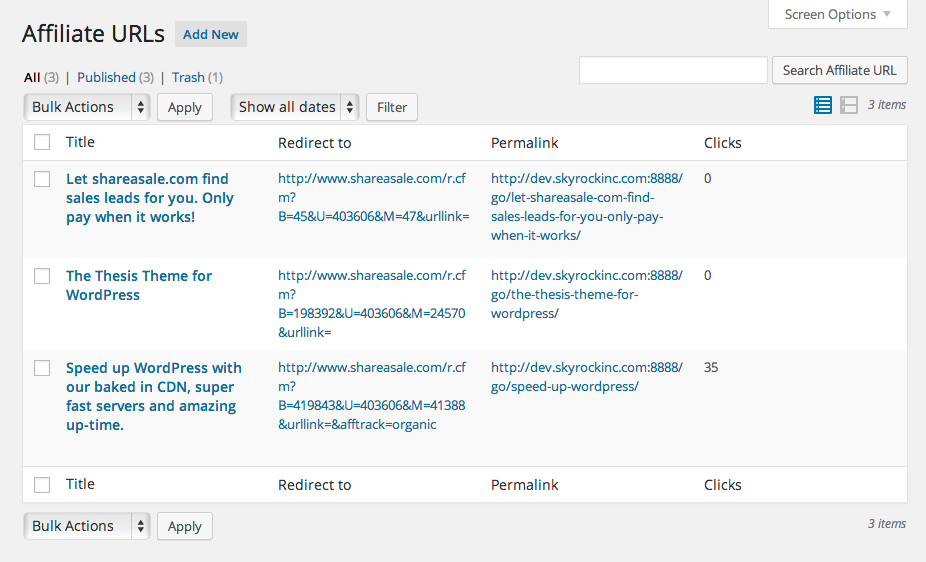

# Affiliate URLs

- Contributors: hypedtext
- Donate link: https://www.paypal.com/cgi-bin/webscr?cmd=_s-xclick&hosted_button_id=WSVM264W5YDNS
- Tags: redirect, click tracking, custom post types, imobitrax, affiliate
- Requires at least: 3.8.1
- Tested up to: 3.8.1
- Stable tag: 0.0.1

Affilate URLs is a complete URL management system for WordPress that allows you create, manage, and track outbound links from your site. Additionally Affiliate URLs allows you to override your redirects with PPC tracking software tracking URLs, a feature of iMobiTrax.

#### Add New Affiliate URL

#### Affiliate URLs

#### Pay Per Click Settings

## Description

Affiliate URLs is a complete URL management system that allows you create, manage, and track outbound links from your site by using custom post types and 301 redirects.

It adds a new custom post type to your Admin menu, where you can create, edit, delete, and manage URLs. It stores click counts in the form of a custom field on that custom post type, so it scales really well.

And by avoiding page based redirects, which is the current trend in masking affiliate links, we avoid any issues with permalink conflicts, and therefore avoid any performance issues.

Affiliate URLs also allows you to override your redirects with PPC tracking software tracking URLs, a feature of iMobiTrax.

## Installation

1. Upload the entire `Affiliate-URLs` folder to the `/wp-content/plugins/` directory
2. DO NOT change the name of the `Affiliate-URLs` folder
3. Activate the plugin through the 'Plugins' menu in WordPress
4. Navigate to `Settings > Permalinks` and save them. Yes, just click save. Trust me.
5. Navigate to the `Affiliate URLs` menu
6. Create a new URL, or manage existing URLs.
7. Publish and use the URLs however you want!

## Frequently Asked Questions

- #### When I try to access my new URL, I'm getting a 404 (not found) error

	Sounds like you didn't follow the installation instructions :-) Navigate to `Settings > Permalinks` and save them. No need to change anything, just click the save button.

- #### Can I change the URL structure to use something other than /go/ ???

	No, not without modifying the plugin.

## Changelog

- #### 0.0.1

	Initial Release